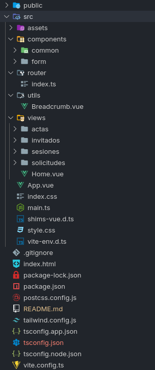
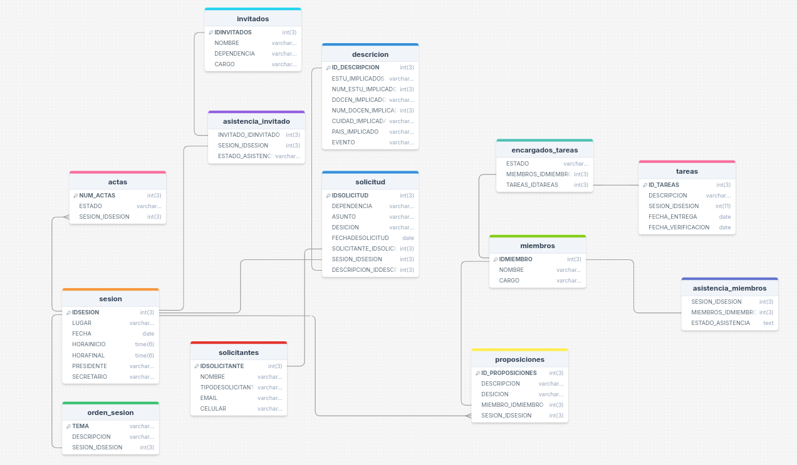

# Diplomado

En este proyecto se trabajan con las siguientes tecnologías

-  [Vue 3](https://vuejs.org/)
-  [TypeScript](https://www.typescriptlang.org/)
-  [Vite](https://vitejs.dev/)
-  [Pinia](https://pinia.vuejs.org/)
-  [Vue Router](https://router.vuejs.org/)
-  [Tailwind CSS](https://tailwindcss.com/)

## Estructura de proyect

Dentro de `src` se encuentra toda la lógica del proyecto, dividido en las siguientes carpetas:

- `assets`: Aquí se encuentran los archivos de imagen y otros recursos estáticos.
- `components`: Aquí se encuentran los componentes de la aplicación.
    - `common`:  Componentes comunes a toda la aplicación. (cómo el footer, sidebar y header)
    - `form`:  Componentes relacionados con formularios.

- `router`:  Aquí se encuentran las rutas de la aplicación.
- `utils`:   Aquí se encuentran los componentes útiles para la aplicación.
- `views`:  Aquí se encuentran las vistas de la aplicación.

## Diagrama base de datos

